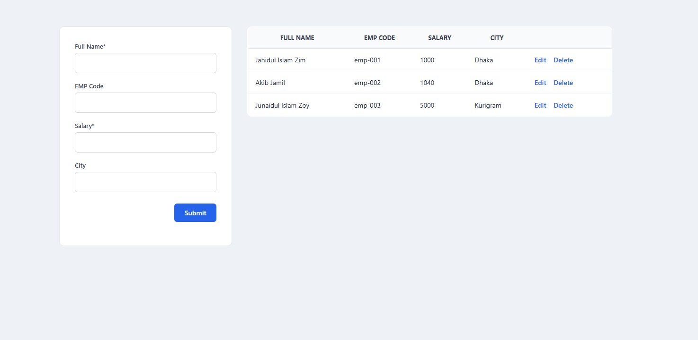

# Employee Management CRUD Application

A simple and professional **Employee Management System** built using **HTML, CSS, and Vanilla JavaScript**.  
This project demonstrates full **CRUD (Create, Read, Update, Delete)** functionality without using any external libraries or frameworks.

---

## Features

- Add new employee records
- Edit existing employee details
- Delete employee records with confirmation
- Client-side form validation
- Clean and professional UI design
- Fully responsive and lightweight
- No dependencies or frameworks

---

## Technologies Used

- HTML5
- CSS3
- JavaScript (ES6)

---

## Project Structure

Vanilla-CRUD/
├── Assets/
│   └── display.png
├── index.html
├── README.md
├── script.js
└── styles.css

---

## Validation Rules

- **Full Name**: Required field
- **Salary**:
  - Required
  - Must be a numeric value
  - Must be greater than zero

Validation errors are shown inline for better user experience.

---

## How to Run the Project

1. Download or clone the repository
2. Open `index.html` in any modern web browser
3. Start managing employee records instantly

No server or build setup required.

---

## Screenshots

---

## Future Enhancements

- Persistent storage using LocalStorage
- Search and filter functionality
- Pagination for large datasets
- Modal-based edit form
- Dark mode support

---

## License

This project is open-source and available for educational and personal use.

---

